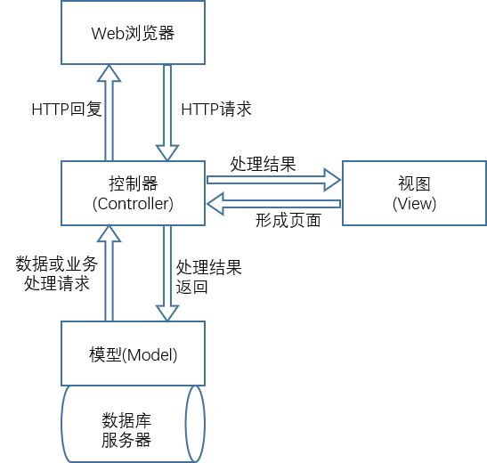
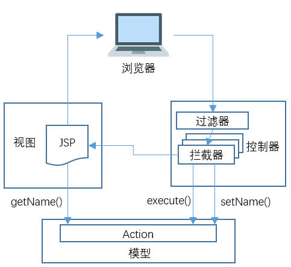

# JavaWeb 入门很简单
## 1. JavaWeb 基础知识
### 1.1 如何学习 Java Web 开发
#### (1). Java语言
#### (2). JDBC
执行SQL语句的 Java API
#### (3). Servlet
运行在服务器端的程序，Servlet 从客户端（通过Web服务器）接收请求
#### (4). JSP(Java Server Pages)技术
从Servlet基础上分离的一小部分，主要用在交互网页的开发，运用Java语法
#### (5) JavaBean(Application)
Java Application的一部分

### 1.2 Java Web 运行原理
静态网站资源（如HTML页面）：浏览的数据始终不变  
动态网站资源：浏览的数据由程序产生，不同时间访问web页面看到内容不同  
**工作原理**：
- (1)浏览器和Web服务器建立连接（浏览器与服务器的一个TCP Socket 套接字连接）
- (2)浏览器发送HTT请求，请求包含：
    - 请求行：一个ASCII文本，由请求的HTTP方法、请求的URL和HTTP版本组成
    - 请求头
    - 空行
    - 消息体：HTTP请求中带有查询字符串时，如果是GET方法，查询字符串或表单数据附加在请求行中，消息体没有内容；如果是POST方法，查询字符串或表单数据就添加在消息体中
- (3)服务器端接收客户端的HTTP请求，生成HTTP响应回发，响应包含：
    - 状态行：每个HTTP响应以一个状态行开头，它由HTTP协议版本、响应状态码和响应描述组成
    - 响应头：前面是HTTP头的名称，后面是HTTP头的值
    - 空行
    - 消息体：要发送回客户端的HTML稳定或其他要显示的内容
- (4)服务器端关闭连接，客户端解析并回发响应，恢复页面。HTTP 响应到达客户端后，浏览器先解析HTTP响应中的状态行，查看请求是否成功的状态码，然后开始下一步解析响应

### 1.3 Java Web 应用程序组成
Java Web 应用程序组成包括3种：
- 配置文件(web.xml)
- 静态文件和 JSP
- 类文件和包

说明：
- 网页可放在Web应用程序根目录下，根据动态页面或静态页面放在不同目录下
- 图像一般会放在images子目录中
- Servlet 类和 JavaBean 类，编译为Class文件后放在WEB-INF/classes目录中
- lib 目录用来包含应用程序需要的jar包
- 标记描述放在 WEB_INF 目录下
- Applet 程序放在应用目录下
- WEB-INF 目录下存放 web.xml部署描述文件器

## 2. HTML + CSS + JavaScript + JSP
### 2.1 HTML
#### 2.1.1 HTML 文档结构
````
<html> 
    <head>
        <title><\title>
    <\head>
    <body>
        HTML正文
    <\body>
<\html>
````

#### 2.1.1 HTML 元素属性
##### <1>. \<meta> 标签
\<meta>标签用于网页的\<head>与\<\head>中，属性有2种：name和http-equiv  
**name 属性**  
用于描述网页，对应于content，其中最重要的是description 和 keywords
````
<meta name="KeyWords" content="Java Web">
<meta name="Description" content="Java Web">
````
**http-equiv属性**  
用于回应给浏览器的有用信息，以帮助正确和精确地显示网页内容  
常用http-equiv类型：(1)Content-Type 和 Content-Language (2)Refresh (3) Expires(期限) (4) Pragma(catch模式) (5) Set-Cookie (6) Window-target (7) Content-Script-Type (8) Page-Enter 、 Page-Exit

##### <2>. \<body>标签
- bgcolor HTML文档背景颜色
- background 背景图片
- bgproperties=fixed 使背景图片成水印效果
- text 正文字体颜色
- 超链接颜色
- leftmargin 和 topmargin 

##### <3>. HTML界面元素
- \<html><\html> 创建HTML文档
- \<head><\head> 设置文档标题及不再页面中显示的信息
- \<title><\title>文档标题
- \<hl><\hl>最大标题
- \<pre><\pre>预先格式化文本
- \<u><\u> 下划线
- \<b><\b> 黑体
- \<i><\i> 斜体
- \<cite><\cite> 引用
- \<em><\em> 强调文本
- \<font size = "" color = ""><\font> 字体大小、颜色

##### <5>.HTML 段落元素
- \<p><\p> 创建段落
- \<p align=""> 左中右对齐
- \<br><\br> 定义行
- \<dl><\dl> 定义列表
- \<ol><\ol> 创建数字列表
- \<ul><\ul> 创建圆点列表
- \<li> 放在每个列表项之前

##### <6>. HTML 链接元素
- \<a href="URL"><\a> 创建超文本链接
- \<a name=""><\a> 创建位于文档内部的书签
- \<a href="#name"><\a> 创建指向位于文档内部书签的链接

### 2.2 DIV + CSS
CSS(Cascading Style Sheets) 用于控制网页样式并将样式信息与网页内容分离的标记语言

#### 2.2.2 Web 标准的构成和布局
Web构成的三个要素： 表现、结构 和 行为
- 表现： 用于对已经被结构化的信息进行显示上的修饰，包括版式、颜色、大小，主要技术就是CSS
- 结构：用来对网页中信息进行整理与分类，常用技术：HTML、XHTML和XML
- 行为：对整个文档内部的一个模型进行定义及交互行为的编写。主要技术有： DOM、JavaScript和Ajax等

DIV + CSS 布局示意图


#### 2.2.3 CSS 语法基础
（暂略）


### 2.3 JavaScript
介于Java 与 HTML 之间的一种基于对象和事件驱动并具有安全性能的脚本语言  
"事件驱动" 值在主页中执行了魔种某种操作所产生的动作，如：点按鼠标、移动窗口、选择菜单  
#### 2.3.1 执行原理
- (1).客户端请求某个网页
- (2). Web服务器响应请求。Web服务器找到请求页面，并将整个页面包含JavaScript的脚本代码作为响应内容，发送回客户端机器
- (3)客户端浏览器解释并执行带脚本的代码。浏览器打开回应的网页文件内容，脚本从服务器端下载到客户端。客户端分担了服务器的任务，减轻服务器压力

#### 2.3.2 常用函数
(1)常规函数
- alert:显示告警对话框，包括确定按钮
- confirm:显示对话框，包括确定和取消按钮
- escape:字符转换成Unicode码
- eval：计算表达式结果
- isNaN:测试true false 不是一个数字
- parseFloat: 将字符串转换为浮点数字
- paseInt:转整型
- unescape:解码
- prompt:显示输入对话框，提示等待用户输入

#### 2.3.3 JavaScript 事件驱动与事件处理
1. 事件驱动：事件是通过鼠标、热键或触摸动作引发的。主要有：
- onClick 单击事件
- onChange 改变事件
- onSelect 选中事件
- onFocus/onBlur 获得/失去焦点事件
- onLoad/onUnload 载入/卸载文件

2. 事件处理程序
对象事件的处理常由函数担任

#### 2.3.4 如何将 JavaScript 加入网页
1. 内部嵌入
````
<Script Language="JavaScript">
JavaScript 代码;
</Script>
````
2. 外部引入
首先创建一个*.js文件，把要实现的JavaScript语句保存在该文件，便于代码复用，使代码简单

#### 2.3.4 JavaScript对象的使用
JavaScript 基于对象而非面向对象，没有抽象、继承、重载  
##### (1).JavaScript中的对象
由属性和方法两个基本元素构成  
- <1> JavScript 对象的定义
````
Function Object(属性表)    //定义一个函数
This.prop1=prop1          //初始化属性
This.prop2=prop2          
This.meth=FunctionName1;  //初始化方法
This.meth=FunctionName2;
````
- <2>创建对象实例
````
newObject = new Object();
````

##### (2).常用对象的属性和方法
- <1> 串(String)对象
- <2> math对象
- <3> 日期及时间对象

### 2.4 JSP动态界面设计
#### 2.4.1 什么是JSP
JSP(Java Server Page)，基于Java语言的一种Web应用开发技术,是一种实现普通静态HTML和动态HTML混合编码的技术，可搭建一个跨平台的动态网站  
JSP是在Servlet基础上产生的  
初学理解：JSP实现了把Java语句写到HTML中  
深入理解：JSP充当View层角色，只用来做先是，不包含业务逻辑，业务逻辑放在JavaBean中，也就是Service对象

#### 2.4.2 JSP 运行原理
JSP是服务端技术，JSP引擎解释JSP代码，结果以HTML或XML形式发送到客户端


原理：
1. 第一次请求JSP页面，JSP页面将先转换为一个Java文件(Servlet)，编译后该Java文件生成对应的class文件，将其加载在内存，然后执行class文件完成响应；
2. 再次请求就直接加载class文件完成响应，每次请求会启动一个线程来负责

#### 2.4.3 JSP 语法
##### 页面组成
开始标签、结束标签和元素内容，统称为JSP元素，是JSP页面组成的主要部分
JSP元素可分为3种不同类型：
- 脚本元素: 规范JSP网页所使用的Java代码，包括HTML注释、隐藏注释、声明、表达式和脚本段
- 指令元素: 针对JSP引擎的，并不直接产生看得见的输出。包括include指令、page指令和taglib指令
- 动作元素: 利用XML语法标记来控制Servlet引擎的行为


##### JSP注释
JSP文件的注释有2种：HTML注释和隐藏注释  
HTML注释发送到客户的，不再浏览器上显示，可在客户端被看到
````
<!--注释[<%=表达式%>]-->
````
隐藏注释：写在JSP代码中，不发送到客户端
````
<%--注释--%>
````

##### JSP 变量和方法的声明
- 必须以";"结尾
- 可一次声明多个变量和方法，必须以","分开，以";"结尾
- 声明范围通常是JSP页面，但如果页面使用include指令包含其他页面，范围扩展到被包含页面
- 可直接使用<%@ page%> 指令中包含进来已声明了的变量和方法，不需要重新声明
- 一个声明仅在一个页面中有效，如果想每个页面都用到一些声明，最好把他们写成一个单独文件，用<%@include%>或\<jsp:include>动作包含进来
````
<%!声明;[声明;]%>
<%! int i=6;%>
<%! Date d=new Date();%>
````
##### JSP 表达式
JSP表达式由变量、常量组成
- 不能用";"作为表达式结束符
- "<%="是一个完整标记，不能有空格
- 表达式元素包含任何在java中有效的表达式
- 表达式可作为其他JSP元素的属性值
````
<%=表达式%>
````
#### 2.4.4 JSP 指令
为JSP引擎设计的，并不直接产生可见输出，只是告诉引擎如何处理其余JSP页面，指令在"<%@ %>"中  
常见指令3种：
- page 指令
- include 指令
- taglib 指令:用来定义一个标记库及标记的前缀

##### <1>page 指令
语法规则
````
<%@ page language="脚本语言"
        extends="继承的父类名称"
        import="导入的java包或类的名称"
        session="true/false"
        buffer="none/8kb/自定义缓存区大小"
        autoflush="true/false"
        isThreadSafe="true/false"
        info="页面信息"
        errorPage="发生错误时转向的页面相对地址"
        isErrorPage="true/false"
        contentType="MIME类型和字符集"
%>
````
注意事项：
- 在一个页面中可使用多个<%@ page%>指令，分别描述不同属性
- 每个属性只能用一次，但是import指令可使用多次
- <%@ page%>指令区分大小写

##### <2>include指令
在JSP网页中插入文件的方式： include指令和jsp:include动作  
被插入的文件可以是JSP文件、HTML文件或其他文本文件  
语法
````
<%@ include file="相对地址" %>
````
> file是include指令的属性，在include指令中只有1个属性

##### <3>taglib指令
定义一个标记库以及标记的前缀  
语法:
````
<%@ taglib uri="URITOLibrary" prefix="标记前缀"%>
````

#### 2.4.5 JSP 动作
用来控制JSP引擎的行为，可以动态插入文件、重用JavaBean组件、导向另一页面  
常见JSP 动作元素
- jsp:include  在页面得到请求时包含一个文件
- jsp:forward  引导请求者进入新页面
- jsp:plugin   连接客户端的Applet或Bean插件
- jsp:useBean  应用JavaBean组件
- jsp:setProperty  设置JavaBean属性
- jsp:getProperty  设置JavaBean属性并输出

##### <1>jsp:include动作
在即将生成的页面动态插入文件，在页面运行时才将文件插入  
语法：
````
<jsp:include page="文件相对路径" flush="true" />或
<jsp:include page="文件相对路径" flush="true">
    <jsp:param name="参数名1" value="参数值1"/>
    <jsp:param name="参数名2" value="参数值2"/>
</jsp:include>
````
> include指令与 jsp:include动作的区别：include指令是静态的，JSP文件被转换成Servlet时候引入文件，把被插入文件插到当前位置后再编译；jsp:include动作是动态的，插入文件时间是在页面被请求的时候，JSP引擎不把插入文件和原JSP文件合并成一个新JSP文件，而是运行时插入文件

##### <2>jsp:forward动作
停止当前页面的执行，转向另一个HTML或JSP页面。JSP引擎不再处理当前页面剩下的内容，缓冲区被清空  
在客户端看到原页面地址，而实际显示另一页面的内容  
语法：
````
<jsp:forward page="文件名">
````

##### <3>jsp:plugin动作
将服务器端Java小程序(Applet)或JavaBean组件下载到浏览器端去执行，相当于在客户端浏览器插入Java插件  
语法:
````
<jsp:plugin
        type="bean | applet"
        code="保存类的文件名"
        codebase="类路径"
        [name="对象名"]
        [archiv="相关文件路径"]
        [align="bottom | top | middle | left | right"]
        [height="displayPixels"]
        [width="displayPixels"]
>
</jsp:plugin>
````

##### <4>jsp:useBean 动作
用来装载一个将要在JSP页面中使用的JavaBean,创建一个JavaBean实例并指定其名字和作用范围
````
<jsp:useBean id="bean的名称" scope="有效范围" class="包名.类名"/>
````

### 2.5 Servlet
#### 2.5.1 什么是Servlet
Servlet是一种服务器端的Java应用程序，可以生成动态Web页面。担当客户请求与服务器响应的中间层。Servlet是位于Web服务器内部的服务器端的Java应用程序，由服务器进行加载  
Servlet=Server + Applet 指Servlet为服务器端的小程序

#### 2.5.2 Servlet 特点

#### 2.5.3 Servlet 生命周期
##### <1>Servlet初始化阶段
在下列时刻Servlet容器装载Servlet
- Servlet容器启动时自动装载某些Servlet，实现它只需在web.xml文件中的\<Servlet>\</Servlet>之间添加：
````
<loadon-startup>1</loadon-startup>
````
- 在Servlet容器启动后，客户首次向Servlet发送请求
- Servlet类文件被更新后，重新装载Servlet

Servlet 被装载后，Servlet容器创建一个Servlet实例并调用Servlet的init()方法进行初始化，在Servlet整个生命周期内，init()方法只被调用一次

##### <2>Servlet响应请求阶段
对用户到达Servlet的请求，Servelet容器会创建特定与这个请求的ServletRequest对象和ServletResponse对象，然后调用Servlet的service方法，从ServletRequest对象获得客户端请求信息，处理该请求，并通过ServletResponse对象向客户返回响应信息 
对Tomcat，它会将传递过来的参数放在一个Hashtable
````
private Hashtable<String String[]> paramHashStringArray = new Hashtable<String String[]>();
````

##### <3>Servlet终止阶段
当Web应用被终止，或Servlet容器终止运行，或Servlet容器重新装载Servlet新实例，Servlet容器会调用Servlet的destroy()方法，释放Servlet的资源

#### 2.5.4 Servlet配置

#### 2.5.5 Servlet使用

### 2.6 JavaBean

### 2.7 XML

HTML描述Web页面显示格式，XML描述Web页面的内容；  
HTML是Web显示数据的通用方法，XML提供了一个直接处理Web数据的通用方法  

#### 2.7.1 XML文档结构

- 声明部分：声明该文档是XML文档
- 定义部分：定义XML数据的类型及其所使用的DTD（可选）
- 内容部分：用XML标签标注过的文档内容

1. XML声明
````
<? xml version encoding standalone?>
<!--version:XML标准版本号
    encoding：编码
    standalone:指定在XML被解析前，是否使用外部或内部DTD，值为yes（内部DTD）或no（外部DTD）；若不使用DTD，则不适用这个属性
-->
````
> 声明语句全为小写

2. 文档定义类型（DTD）
    - 作用：定义XML文档内容的结构，按统一格式存储信息
    - 创建DTD，XML使用的元素可在内部/外部定义
        - 内部：
            ````
            <!DOCTYPE rootelement
            [element and attribute declarations]
            >
            ````
        - 外部：
            ````
            <!DOCTYPE rootelement [PUBLIC|SYSTEM] "name-of-file">
            <!--PUBLIC表示DTD存放在公用服务器，SYSTEM表示存放在本地计算机-->
            ````
    - 在DTD中定义元素
        ````
        <!ELEMENT elementname content>
        ````
3. XML文档内容编辑  
XML 必须包含根元素，形成文档树
````
<root>
<child>
<subchild>...</subchild>
</child>
</root>
````

4. XML文档解析


## 3. JavaWeb 开发模式
### 3.1 JavaWeb开发组件联系和原理
#### 3.1.1 JSP+JavaBean
以JSP为中心的设计模式  

#### 3.1.2 JSP+JavaBean+Servlet
Servlet充当控制器角色，负责接收客户端web浏览器发送来的请求，依据处理的不同结果，转发到对应JSP页面（viewer）实现在浏览器端的显示；  
JSP充当视图的角色，负责输出响应结果；  
JavaBean充当模型的角色，负责具体业务逻辑和业务数据

开发步骤：
1. 定义一系列的Bean来表示数据
2. 使用一个Servlet来处理请求
3. 在Servlet中填充Bean
4. 在Servlet中，将Bean存储到请求、会话或者Servlet上下文中
5. 将请求转到JSP页面
6. 在JSP页面，从Bean中提取数据

### 3.2 真正原理
#### 两种方式的特点
JSP + JavaBean：
- 程序可读性高
- 可重复利用性高
- 缺乏流程控制，每一个JSP都要验证需求的参数正确度、确认用户身份权限、异常等问题


JSP+Servlet+JavaBean:
- JSP页内没有处理逻辑，仅负责检索原先由Servlet创建的对象或JavaBean，从Servlet中提取动态内容插入静态模板
- 分离了内容与表达
- 核心的程序管控

### 3.3 MVC模式
MVC：Model（模型）-View（视图）-Controller（控制器）


## 4. JavaWeb 开发框架
### 4.1 JavaWeb开发框架
共同特点：都遵循MVC设计模式
### 4.2 Struts
Struts2是传统Struts1注入WebWork的设计理念的框架  

#### 4.2.1 Struts2组成
核心控制器FilterDispatcher（由Struts2框架提供）、业务控制器和业务逻辑组件（用户自己实现）
|组件|作用|
|---|---|
|FilterDispatcher|起中央控制器作用的过滤器|
|Action|处于Model层的Action，调用JavaBean实现业务逻辑|
|struts.xml|核心配置文件，配置有Action、Result等|
|result|和forward类似，转发的目的地，支持多种视图技术|

#### 4.2.2 Struts2应用
Struts1的入口点是一个Servlet，Struts2的入口点是一个过滤器(Filter)  


### 4.3 Spring
#### 4.3.1 Spring 概念
1. spring是开源的轻量级框架
2. spring核心2部分：
    - AOP：面向切面编程，扩展功能不是修改源代码实现
    - IOC：反转控制
        - 原来：使用类对象调用方法，创建类对象的过程需要new出新对象
        - 对象的创建过程不用new方式实现，而是交给spring配置创建类对象
3. spring是一站式框架
    - spring在javaEE三层结构中，每一层都提供不同的解决技术
        - web层：SpringMVC
        - service层：Spring的IOC
        - DAO层：Spring的JDBCTemplate
4. spring版本
    - struts2/Hibernate5.x/Spring4.x

#### 4.3.2 Spring的IOC操作
1. 把对象的创建交给Spring进行管理
2. IOC操作两部分：
    - IOC的配置文件方式
    - IOC的注解方式

#### 4.3.3 IOC底层原理
1. IOC底层原理使用的技术
    - xml配置文件
    - dom4j 解决 xml
    - 工厂设计模式
    - 反射

2. 分析IOC原理
````
/**java bean
*/
public class UserService {

}
public class UserServlet{
    //得到UserService的对象
    //原始：new创建
    UserFactory.getService();
}
````

第一步，创建xml文件，配置要创建对象类
````
<bean id="userService" class="xx.xxx.UserService">
````

第二步 创建工厂类，使用DOM4j解析配置文件+反射
````
public class UserFactory{
    //返回UserService对象的方法
    public static UserService getService() {
        //1.使用dom4j解析xml文件
        //根据ID值 userService, 得到id值对应class属性值
        String classValue = "class属性值";
        //2.使用反射来创建类的对象
        Class clazz = Class.forName(classValue);
        //创建类对象
        UserService service = clazz.newInstance();
        return service;
    }
}
````

3. IOC入门案例
- 第一步 导入jar包
    - 做spring最基本功能时，只需4个核心jar包：Beans、Core、Context、SpEL
    - 导入支持日志输出的jar包
- 第二步 创建类，在类里面创建方法
    ````
    public class User {
        public void add() {
            System.out.println("add");
        }
    }
    ````
- 第三步 创建Spring配置文件，配置创建类
    - (1)Spring 核心配置文件名称和位置不是固定的
        - 官方建议applicationContext.xml,建议放在src下
    - (2)引入schema约束（在doc中可找到对应的html文件，底端有约束样例）
        ````
        <beans>
            <bean id="user" class="xx.xxx.User"/>
        </beans>
        ````
- 第四步 写代码测试对象创建
    ````
    public class TestIOC{
        @Test
        public void testUser() {
            //1.加载spring配置文件，根据创建对象
            ApplicationContext context = 
                        new ClassPathXmlApplication("applicaion.xml");
            //2.得到配置创建的对象
            User user = (User) context.getBean("user");
            user.add();
        }
    }
    ````
#### 4.3.3 Spring 的 Bean管理（xml方式）
1. Bean实例化的方式
- 在Spring里面通过配置文件创建对象
- bean实例化是那种实现方式
    - 第一种 使用类的无参构造创建（重点）
        - 见上一节入门案例
    - 第二种 使用静态工厂创建
        - 创建静态的方法，返回类对象
        ````
        public class BeanFactory{
            public static Bean getBean() {
                return new Bean();
            }
        }
        ````
        ````
        <bean id="bean" class="x.xx.BeanFactory" factory-method="getBean"></bean>
        ````
    - 第三种 使用实例工厂创建
        - 创建非静态方法，返回类对象
        ````
        <bean id="bean" class="x.xx.BeanFactory" factory-bean="beanFactory" factory-method="getBean"></bean>
        ````
2. Bean 标签常用属性
- id属性：起名称，任意（不能用中文、#、_）
    - 根据id值得到配置对象
- class：创建对象所在类的全路径
- name：功能与Id一样，但可以包含特殊符号，目前不用，为了整合Struts1
- scope：bean的作用范围
    - singleton:默认值，单例
    - protoptype:多例
    - request:创建对象，把对象放到request域
    - session：创建对象，放到session域
    - globalSession

#### 4.3.4 属性注入
1. 创建对象时，向类里属性设置值
2. 注入的3种方式
    - set方法注入（spring中用的最多）
        ````
        <bean id="book" class="x.xx.Book">
            <!--注入属性值-->
            <property name="bookname" value="LL"></property>
        </bean>
        ````
    - 有参构造
        ````
        <bean id="demo" class="x.xx.Demo">
            <!--有参构造-->
            <constructor-arg name="username" value="Admin"></constructor-arg>
        </bean>
        ````
    - 使用接口
3. 在Spring中，只支持前2种方式

#### 4.3.5 注入对象类型属性
1. 创建两个类（User和Service）
    - 在Service中得到user对象
2. 具体实现过程
    - 在service中把user作为成员变量
    - 写User成员的set方法

3. 在配置文件中完成注入关系
````
<!--配置对象-->
<bean id="user" class="x.xx.User"></bean>
<bean id="service" class="x.xx.Service">
    <!--注入对象，不能写value属性，现在用的是对象;而要用ref,写user的bean标签id值-->
    <property name="user" ref="user"></property>
</bean>
````

#### 4.3.6 注入复杂类型属性
1. 数组
2. list
3. map
4. properties

````
<bean id="user" class="xx.xx.User">
    <!--数组-->
    <property name="array">
        <list>
            <value>Mon</value>
            <value>Tue</value>
            <value>Wed</value>
        </list>
    </property>

    <!--list-->
    <property name="list">
        <list>
            <value>Mon</value>
            <value>Tue</value>
            <value>Wed</value>
        </list>
    </property>

    <!--map-->
    <property name="map">
        <map>
            <enrty key="Mon" value="1"></entry>
            <entry key="Tue" value="2"></entry>
        </map>
    </property>

    <!--properties-->
    <property name="properties">
        <props>
            <prop key="Mon">1</prop>
        </props>
    </property>
</bean>
````

#### 4.3.6 IOC与DI区别
- IOC：控制反转，把对象创建交给Spring进行配置
- DI：依赖注入，向类里面的属性中设置值
- 关系：依赖注入不能单独存在，需要在IOC基础上完成

#### 4.3.7 Spring 整合web项目原理
1. 加载spring核心配置文件，如果用new，功能可以实现，但效率低
2. 实现思想：把加载配置文件和创建对象过程，在服务器启动时完成
3.实现原理
    - ServletContext对象
    - 监听器
    - 具体使用：
        - 在服务器启动时候，为每个项目创建一个ServletContext对象
        - 在ServletContext对象创建时，使用监听器可监听到ServletContext对象创建
        - 加载spring配置文件，用配置文件配置对象创建
        - 把创建出来的对象放到ServletContext域对象里(setAttribute方法)
        - 获取对象时，到ServletContext域得到(getAttribute方法)

#### 4.3.8 Spring的bean管理（注解）
1. 注解：
    - 代码里的特殊标记，使用注解可完成功能
    - 注解写法：@注解名称(属性名称=属性值)
    - 注解使用在类/方法/属性上面

2. Spring注解开发准备
    - 导入jar包（最基本：commons-logging、log4j、spring-beans、spring-context、spring-core、spring-expression）（以及aop）
    - 创建类、方法
    - 创建spring配置文件，引入约束
        - beans
        - context
            ````
            <beans>
                <!--开启注解扫描
                到包里的类、方法、属性上面是否有注解-->
                <context:component-scan base-package="xx.xx"></context:component-scan>
                <!--只扫描属性上面的注解-->
                <context:annotation-config></context:annotation-config>
            </beans>
            ````
    - 开启注解扫描

3. 注解创建对象
    - 在创建对象的类上面使用注解实现
        ````
        @Component(value="user")    //<bean id="user" class="">
        public class User{

        }
        ````
    - 创建对象有4个注解
        - @Component 有3个衍生注解（目前功能一致）
        - @Controller:web层
        - @Service：业务层
        - @Repository：持久层
        - 目前这四个注解功能是一样的，都创建对象
    - 创建对象单实例/多实例
        ````
        @Component(value="user")
        @Scope(value="prototype")
        ````

4. 注解注入属性
    - 创建service类，创建user类，在service得到user对象
        - 创建user和service对象
            ````
            @Component(value="user")
            public class User{
                //
            }
            ````
            ````
            @Component(value="service")
            public class Service{
                //
            }
            ````
        - 在Service里定义user成员变量
            - 方式1 @Autowire
                ````
                @Component(value="service")
                public class Service{
                    @Autowired
                    private User user;
                    //使用注解方式时不需要使用set方法  
                }
                ````
            - 方式2 @Resource
                ````
                @Component(value="service")
                public class Service{
                    //name属性值写注解创建user对象的value值
                    @Resource(name="user")
                    private User user;
                }
                ````
5. 配置文件和注解混合使用
    - 创建对象操作使用配置文件方式实现
        ````
        <bean id="" class=""></bean>
        ````
    - 注入属性的操作用注解方式实现
        ````
        public class Service{
            @Resource(name="user")
            private User user;
        }
        ````

#### 4.3.9 AOP概念
1. AOP：面向切面编程，扩展功能不修改源代码实现
2. AOP采取横向抽取机制，取代纵向继承体系重复性
    - 第一种情况：有接口，使用jdk动态代理
        - 使用动态代理方式，创建接口实现类代理对象
    - 第二种情况：没有接口，使用cglib动态代理
        - 创建子类代理对象
        - 在子类里调用父类方法完成增强

#### 4.3.10 AOP 术语

1. Join Point 连接点：类里面哪些方法可被增强，这些方法称为连接点

2. Pointcut 切入点：在类里有很多方法可被增强，实际增强的某个方法叫切入点

3. Advice 通知/增强：增强的逻辑，如扩展某个方法的功能
    - 前置通知：在方法之前执行
    - 后置：之后
    - 异常：方法出现异常
    - 最终：后置之后
    - 环绕：之前和之后

4. Aspect 切面：把增强应用到具体方法上面，过程称为切面
    - 把增强用到切入点的过程

#### 4.3.11 Spring 的 AOP 操作

1. zaiSpring里进行AOP操作，使用AspectJ实现

2.使用AspectJ实现AOP有2种方式
    - 基于AspectJ的xml配置
    - 基于AspectJ的注解方式

3. AOP操作准备
    - 导入除基本jar包外，还要aop、aspectj包
    - 创建Spring核心配置文件，引入aop约束

4. 使用表达式配置切入点
    - 常用表达式：
        - execution(<访问修饰符>?<返回类型><方法名>(<参数>)<异常>)
        - (1) execution(* xx.xx.Book.add(..))
        - (2) execution(* xx.xx.Book.x(..))
        - (3) execution(* *.*(..))

5.AspectJ的AOP操作
````
    <!--1.配置对象-->
    <bean id="book" class="xx.xx.Book"></bean>
    <bean id="myBook" class="xx.xx.MyBook"></bean>
    <!--2.配置aop操作-->
    <aop:config>
        <!--2.1配置切入点-->
        <aop:pointcut expression="execution(* xx.xx.Book.*(..))" id="pointcut1"/>
        <!--2.2配置切面，把增强用到方法上-->
        <aop:aspect ref="myBook">
            <!--配置增强类型
                method：增强类里面使用哪个方法作为前置-->
                <aop:before method="read" pointcut-ref="pointcut1"/>
        </aop:aspect>
    </aop:config>
````

#### 4.3.12 Log4j 介绍
1. 通过log4j开运行时信息

2. 使用
    - 导入log4j的jar包
    - 复制log4j的配置文件，复制到src下
        - log4j.properties

3.设置日志级别
    - info/debug/..

#### 4.3.13 Spring的JDBC Template
````
public class JDBCTemplateDemo {
    public void add() {
        //设置数据库信息
        DriverManagerDataSource dataSource = new DriverManagerDataSource();
        dataSource.setDriverClassName("com.mysql.jdbc.Driver");
        dataSource.setUrl("jdbc:mysql:///program_name");
        dataSource.setUsername("root");
        dataSource.setPassword("passwod");
        
        //创建jdbcTemplate对象，设置数据源
        JdbcTemplate jdbcTemplate = new JdbcTemplate(dataSource);

        //调用jdbcTemplate对象里的方法实现操作
        String sql = "insert into user values(?, ?)";
        int rows = jdbcTemplate.update(sql, "luck", "250");
        System.out.println(rows);
    }
}
````
