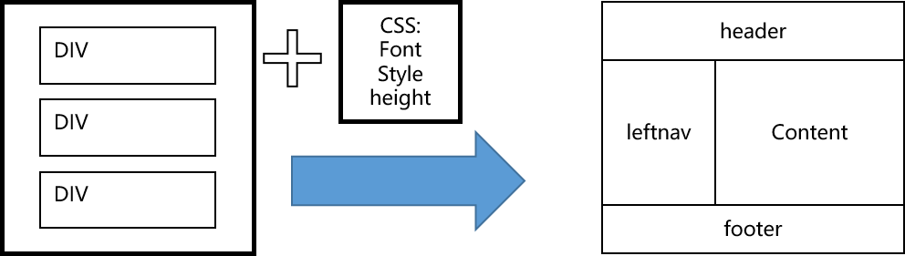
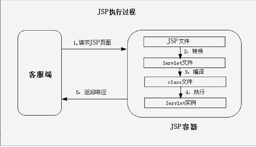
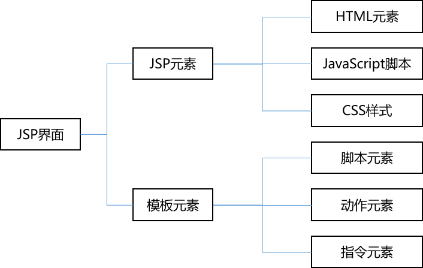

# JavaWeb 入门很简单
## 1. JavaWeb 基础知识
### 1.1 如何学习 Java Web 开发
#### (1). Java语言
#### (2). JDBC
执行SQL语句的 Java API
#### (3). Servlet
运行在服务器端的程序，Servlet 从客户端（通过Web服务器）接收请求
#### (4). JSP(Java Server Pages)技术
从Servlet基础上分离的一小部分，主要用在交互网页的开发，运用Java语法
#### (5) JavaBean(Application)
Java Application的一部分

### 1.2 Java Web 运行原理
静态网站资源（如HTML页面）：浏览的数据始终不变  
动态网站资源：浏览的数据由程序产生，不同时间访问web页面看到内容不同  
**工作原理**：
- (1)浏览器和Web服务器建立连接（浏览器与服务器的一个TCP Socket 套接字连接）
- (2)浏览器发送HTT请求，请求包含：
    - 请求行：一个ASCII文本，由请求的HTTP方法、请求的URL和HTTP版本组成
    - 请求头
    - 空行
    - 消息体：HTTP请求中带有查询字符串时，如果是GET方法，查询字符串或表单数据附加在请求行中，消息体没有内容；如果是POST方法，查询字符串或表单数据就添加在消息体中
- (3)服务器端接收客户端的HTTP请求，生成HTTP响应回发，响应包含：
    - 状态行：每个HTTP响应以一个状态行开头，它由HTTP协议版本、响应状态码和响应描述组成
    - 响应头：前面是HTTP头的名称，后面是HTTP头的值
    - 空行
    - 消息体：要发送回客户端的HTML稳定或其他要显示的内容
- (4)服务器端关闭连接，客户端解析并回发响应，恢复页面。HTTP 响应到达客户端后，浏览器先解析HTTP响应中的状态行，查看请求是否成功的状态码，然后开始下一步解析响应

### 1.3 Java Web 应用程序组成
Java Web 应用程序组成包括3种：
- 配置文件(web.xml)
- 静态文件和 JSP
- 类文件和包

说明：
- 网页可放在Web应用程序根目录下，根据动态页面或静态页面放在不同目录下
- 图像一般会放在images子目录中
- Servlet 类和 JavaBean 类，编译为Class文件后放在WEB-INF/classes目录中
- lib 目录用来包含应用程序需要的jar包
- 标记描述放在 WEB_INF 目录下
- Applet 程序放在应用目录下
- WEB-INF 目录下存放 web.xml部署描述文件器

## 2. HTML + CSS + JavaScript + JSP
### 2.1 HTML
#### 2.1.1 HTML 文档结构
````
<html> 
    <head>
        <title><\title>
    <\head>
    <body>
        HTML正文
    <\body>
<\html>
````

#### 2.1.1 HTML 元素属性
##### <1>. \<meta> 标签
\<meta>标签用于网页的\<head>与\<\head>中，属性有2种：name和http-equiv  
**name 属性**  
用于描述网页，对应于content，其中最重要的是description 和 keywords
````
<meta name="KeyWords" content="Java Web">
<meta name="Description" content="Java Web">
````
**http-equiv属性**  
用于回应给浏览器的有用信息，以帮助正确和精确地显示网页内容  
常用http-equiv类型：(1)Content-Type 和 Content-Language (2)Refresh (3) Expires(期限) (4) Pragma(catch模式) (5) Set-Cookie (6) Window-target (7) Content-Script-Type (8) Page-Enter 、 Page-Exit

##### <2>. \<body>标签
- bgcolor HTML文档背景颜色
- background 背景图片
- bgproperties=fixed 使背景图片成水印效果
- text 正文字体颜色
- 超链接颜色
- leftmargin 和 topmargin 

##### <3>. HTML界面元素
- \<html><\html> 创建HTML文档
- \<head><\head> 设置文档标题及不再页面中显示的信息
- \<title><\title>文档标题
- \<hl><\hl>最大标题
- \<pre><\pre>预先格式化文本
- \<u><\u> 下划线
- \<b><\b> 黑体
- \<i><\i> 斜体
- \<cite><\cite> 引用
- \<em><\em> 强调文本
- \<font size = "" color = ""><\font> 字体大小、颜色

##### <5>.HTML 段落元素
- \<p><\p> 创建段落
- \<p align=""> 左中右对齐
- \<br><\br> 定义行
- \<dl><\dl> 定义列表
- \<ol><\ol> 创建数字列表
- \<ul><\ul> 创建圆点列表
- \<li> 放在每个列表项之前

##### <6>. HTML 链接元素
- \<a href="URL"><\a> 创建超文本链接
- \<a name=""><\a> 创建位于文档内部的书签
- \<a href="#name"><\a> 创建指向位于文档内部书签的链接

### 2.2 DIV + CSS
CSS(Cascading Style Sheets) 用于控制网页样式并将样式信息与网页内容分离的标记语言

#### 2.2.2 Web 标准的构成和布局
Web构成的三个要素： 表现、结构 和 行为
- 表现： 用于对已经被结构化的信息进行显示上的修饰，包括版式、颜色、大小，主要技术就是CSS
- 结构：用来对网页中信息进行整理与分类，常用技术：HTML、XHTML和XML
- 行为：对整个文档内部的一个模型进行定义及交互行为的编写。主要技术有： DOM、JavaScript和Ajax等

DIV + CSS 布局示意图


#### 2.2.3 CSS 语法基础
（暂略）


### 2.3 JavaScript
介于Java 与 HTML 之间的一种基于对象和事件驱动并具有安全性能的脚本语言  
"事件驱动" 值在主页中执行了魔种某种操作所产生的动作，如：点按鼠标、移动窗口、选择菜单  
#### 2.3.1 执行原理
- (1).客户端请求某个网页
- (2). Web服务器响应请求。Web服务器找到请求页面，并将整个页面包含JavaScript的脚本代码作为响应内容，发送回客户端机器
- (3)客户端浏览器解释并执行带脚本的代码。浏览器打开回应的网页文件内容，脚本从服务器端下载到客户端。客户端分担了服务器的任务，减轻服务器压力

#### 2.3.2 常用函数
(1)常规函数
- alert:显示告警对话框，包括确定按钮
- confirm:显示对话框，包括确定和取消按钮
- escape:字符转换成Unicode码
- eval：计算表达式结果
- isNaN:测试true false 不是一个数字
- parseFloat: 将字符串转换为浮点数字
- paseInt:转整型
- unescape:解码
- prompt:显示输入对话框，提示等待用户输入

#### 2.3.3 JavaScript 事件驱动与事件处理
1. 事件驱动：事件是通过鼠标、热键或触摸动作引发的。主要有：
- onClick 单击事件
- onChange 改变事件
- onSelect 选中事件
- onFocus/onBlur 获得/失去焦点事件
- onLoad/onUnload 载入/卸载文件

2. 事件处理程序
对象事件的处理常由函数担任

#### 2.3.4 如何将 JavaScript 加入网页
1. 内部嵌入
````
<Script Language="JavaScript">
JavaScript 代码;
</Script>
````
2. 外部引入
首先创建一个*.js文件，把要实现的JavaScript语句保存在该文件，便于代码复用，使代码简单

#### 2.3.4 JavaScript对象的使用
JavaScript 基于对象而非面向对象，没有抽象、继承、重载  
##### (1).JavaScript中的对象
由属性和方法两个基本元素构成  
- <1> JavScript 对象的定义
````
Function Object(属性表)    //定义一个函数
This.prop1=prop1          //初始化属性
This.prop2=prop2          
This.meth=FunctionName1;  //初始化方法
This.meth=FunctionName2;
````
- <2>创建对象实例
````
newObject = new Object();
````

##### (2).常用对象的属性和方法
- <1> 串(String)对象
- <2> math对象
- <3> 日期及时间对象

### 2.4 JSP动态界面设计
#### 2.4.1 什么是JSP
JSP(Java Server Page)，基于Java语言的一种Web应用开发技术,是一种实现普通静态HTML和动态HTML混合编码的技术，可搭建一个跨平台的动态网站  
JSP是在Servlet基础上产生的  
初学理解：JSP实现了把Java语句写到HTML中  
深入理解：JSP充当View层角色，只用来做先是，不包含业务逻辑，业务逻辑放在JavaBean中，也就是Service对象

#### 2.4.2 JSP 运行原理
JSP是服务端技术，JSP引擎解释JSP代码，结果以HTML或XML形式发送到客户端


原理：
1. 第一次请求JSP页面，JSP页面将先转换为一个Java文件(Servlet)，编译后该Java文件生成对应的class文件，将其加载在内存，然后执行class文件完成响应；
2. 再次请求就直接加载class文件完成响应，每次请求会启动一个线程来负责

#### 2.4.3 JSP 语法
##### 页面组成
开始标签、结束标签和元素内容，统称为JSP元素，是JSP页面组成的主要部分
JSP元素可分为3种不同类型：
- 脚本元素: 规范JSP网页所使用的Java代码，包括HTML注释、隐藏注释、声明、表达式和脚本段
- 指令元素: 针对JSP引擎的，并不直接产生看得见的输出。包括include指令、page指令和taglib指令
- 动作元素: 利用XML语法标记来控制Servlet引擎的行为



##### JSP注释
JSP文件的注释有2种：HTML注释和隐藏注释  
HTML注释发送到客户的，不再浏览器上显示，可在客户端被看到
````
<!--注释[<%=表达式%>]-->
````
隐藏注释：写在JSP代码中，不发送到客户端
````
<%--注释--%>
````

##### JSP 变量和方法的声明
- 必须以";"结尾
- 可一次声明多个变量和方法，必须以","分开，以";"结尾
- 声明范围通常是JSP页面，但如果页面使用include指令包含其他页面，范围扩展到被包含页面
- 可直接使用<%@ page%> 指令中包含进来已声明了的变量和方法，不需要重新声明
- 一个声明仅在一个页面中有效，如果想每个页面都用到一些声明，最好把他们写成一个单独文件，用<%@include%>或\<jsp:include>动作包含进来
````
<%!声明;[声明;]%>
<%! int i=6;%>
<%! Date d=new Date();%>
````
##### JSP 表达式
JSP表达式由变量、常量组成
- 不能用";"作为表达式结束符
- "<%="是一个完整标记，不能有空格
- 表达式元素包含任何在java中有效的表达式
- 表达式可作为其他JSP元素的属性值
````
<%=表达式%>
````
#### 2.4.4 JSP 指令
为JSP引擎设计的，并不直接产生可见输出，只是告诉引擎如何处理其余JSP页面，指令在"<%@ %>"中  
常见指令3种：
- page 指令
- include 指令
- taglib 指令:用来定义一个标记库及标记的前缀

##### page 指令
语法规则
````
<%@ page language="脚本语言"
        extends="继承的父类名称"
        import="导入的java包或类的名称"
        session="true/false"
        buffer="none/8kb/自定义缓存区大小"
        autoflush="true/false"
        isThreadSafe="true/false"
        info="页面信息"
        errorPage="发生错误时转向的页面相对地址"
        isErrorPage="true/false"
        contentType="MIME类型和字符集"
%>
````
注意事项：
- 在一个页面中可使用多个<%@ page%>指令，分别描述不同属性
- 每个属性只能用一次，但是import指令可使用多次
- <%@ page%>指令区分大小写


