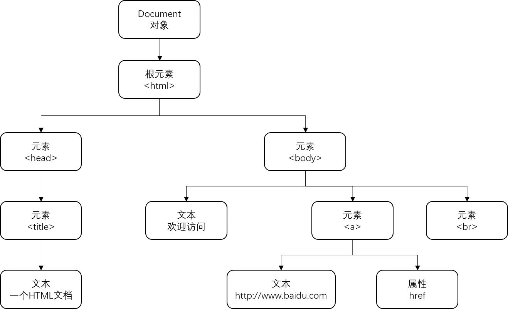
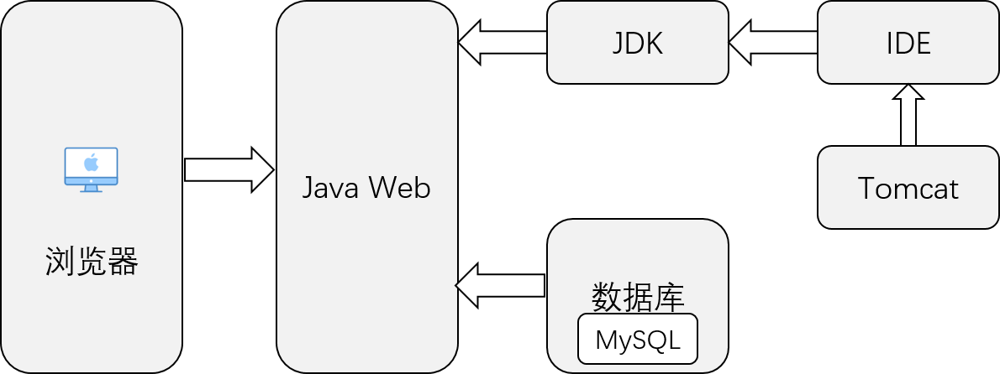
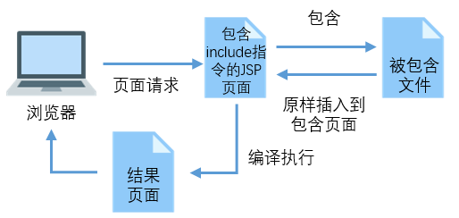
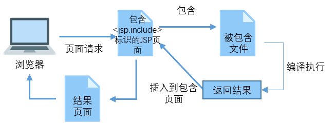
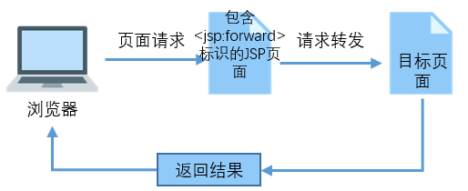

# Java Web

## 1. Java Web 应用开发概述

### 1.1 程序开发体系结构

C/S： Client/Server结构，服务器采用高性能PC或工作站，并采用大型数据库，客户端需安装专用客户端软件  
B/S： Brower/Server结构，客户端不需要开发任何用户界面，统一采用浏览器，通过Web浏览向服务器发送请求，由Web服务器实现功能，节约成本

### 1.2 Web 应用工作原理

Web应用分为两种：静态网页、动态网页

静态网页用HTML语言编写，放在Web服务器上，用户使用浏览器通过HTTP协议请求服务器上的Web页面，服务器收到用户请求处理后，发送给客户端浏览器，显示给用户

更多的内容需要根据用户的请求动态生成页面信息，通常使用HTML语言和动态脚本语言编写，并将程序部署到Web服务器上，由Web服务器对动态脚本代码进行处理，并转化为浏览器可解析的HTML代码，返回给客户端浏览器，显示给用户

> 动态网页是指具有交互性、内容可以自动更新并且内容会根据访问时间和访问者而改变

### 1.3 Web应用技术

#### 客户端应用的技术

1. HTML语言  
主要用于显示网页信息，由浏览器解释执行，不需要编译  
HTML语言不区分大小写
2. CSS  
一种样式表技术，也称为层叠样式表(Cascading Style Sheet),可以有效地对页面布局、字体、颜色、背景和其他效果实现更精确的控制
3. Flash  
交互式矢量动画制作技术
4. 客户端脚本技术  
嵌入到Web页面中的程序代码，是一种解释性语言，浏览器可对客户端脚本进行解释。通过脚本语言可实现以编程的方式对页面元素进行控制，从而增加页面的灵活性。常用客户端脚本语言有JavaScript和VBScript

#### 服务器端应用的技术

1. CGI  
Common Gateway Interface 最早用来创建动态网页的技术
2. ASP  
Active Server Page 通过在页面代码中嵌入 VBScript 或 JavaScript 脚本语言，来生成动态内容，在服务器端必须安装适当的解释器才可通过调用解释器执行脚本程序，然后将执行结果与静态内容结合传送到客户端浏览器上
3. PHP
一种开源的Web服务器脚本语言，与ASP一样可在页面中加入脚本代码生成动态内容。提供标准的数据库接口，数据库连接方便，扩展性强
4. ASP.NET
.NET框架的一部分，可以使用任何.NET兼容的语言来编写
5. JSP
Java Server Page 以Java为基础，沿用Java的API，JSP页面中的HTML代码来显示静态部分，嵌入页面的Java代码与JSP标记用来生成动态内容。JSP可以被预编译

## 2. HTML 与 CSS 网页开发基础

### 2.1 HTML 标记语言

#### HTML 文档结构

HTML 文档由4个标记组成：&lt;html>、&lt;head>、&lt;title>和&lt;body>
1. &lt;html>标记  
&lt;html>标记是HTML文件的开头。所有HTML文件均以&lt;html>标记开头，以&lt;/html>标记结束。&lt;html>标记并无实质功能，但不可缺少
2. &lt;head>标记  
&lt;head>标记是HTML的头标记，作用是放置HTML文件的信息。如定义CSS样式代码可放在&lt;head>与&lt;/head>标记中
3. &lt;title>标记  
&lt;title>标记为标题标记，可将网页的标题定义在&lt;title>与&lt;/title>标记中
4. &lt;body>标记
 &lt;body>是HTML页面的主体标记，页面中所有内容都定义在&lt;body>标记中 

#### 2.1.3 HTML 常用标记

- 换行标记  &lt;br>
- 段落标记 &lt;p>开头  &lt;/p>结束
- 标题标记 HTML设定了6级标题标记分别为&lt;h1>到&lt;h6>
- 居中标记 &lt;center>开头，&lt;/center>结束
- 文字列表标记  可以将文字以列表形式依次排列，分为无序列表和有序列表 
  - 无序列表在每个列表项前面添加一个圆点符号，通过符号<ul>可创建一组无序列表，每个列表项以&lt;li>表示

#### 2.1.4 表格标记
表格标记 &lt;table>  
标题 &lt;caption>  
表头 &lt;th>  
表格换行 &lt;tr>  
单元格 &lt;td>  

#### 2.1.5 表单标记

1. \<form>  
属性： 
  - action: 指定表单数据程序的URL
  - method: 指定数据传送到服务器的方式，分为get和post。get表示将输入的数据追加在action指定的地址后面，并传送到服务器；post将输入的数据按照HTTP协议中传输方式传送到服务器
  - name : 指定表单的名称
  - onSubmit : 指定当用户单击提交按钮时触发的事件
  - target : 指定输入数据结果显示在哪个窗口，可设置为_blank、_self、_parent和_top

2. &lt;input>
输入标记

3. &lt;select>
下拉列表框标记

4. &lt;textarea>
多行文本标记

## 3. JavaScript 脚本语言

### 3.1 了解 JavaScript

JavaScript 是一种基于对象和事件驱动并具有安全性能的解释型脚本语言。不需要编译，而是直接嵌入在HTTP页面中  
主要特点：
- 解释性
- 基于对象
- 事件驱动：可以以时间驱动的方式直接对客户端的输入作出响应，无须经过服务器端程序
- 安全性：不允许访问本地硬盘，不能将数据写入到服务器上，不允许对网络文档进行修改和删除，只通过浏览器实现信息浏览或动态交互
- 跨平台

### 3.2 JavaScript 语言基础

#### 3.2.1 语法

- 区分的大小写
- 分号可有可无
- 变量是弱类型的
  - 在定义变量时，只使用var运算符，可以将变量初始化为任意值
- 使用大括号标记代码块
- 注释
  - 单行注释//
  - 多行注释/**/

#### 3.2.2 关键字

#### 3.2.3 数据类型

1. 数值型
  - 整型
  - 浮点型
2. 字符型
  - 单引号括起来一个或多个字符
  - 双引号括起来一个或多个字符
  > JavaScript 没有char数据类型，要表示单个字符，必须使用长度为1的字符串
3. 布尔型
  - true 或 false
  - 也可用0来表示false，非0整数表示true
4. 转义字符
5. 空值  
  JavaScript 中有一个null，用于定义空的或不存在的引用
  > 空值不等于空的字符串("")或0
6. 未定义值
  使用了一个已声明但没有赋值的变量时，将返回未定义值(undefined)

#### 3.2.4 变量的定义及使用

1. 变量命名规则
2. 变量声明  
  ````
  var variable;
  ````
   JavaScript采用弱类型，所以在声明变量时不需要指定变量的类型，而变量的类型将根据变量的值来确定  
3. 变量的作用域  
  - 局部变量：定义在函数体内
  - 全局变量：定义在所有函数外

#### 3.2.5 运算符

1. 赋值
2. 算术
3. 比较
4. 逻辑
5. 条件
6. 字符串运算符
  + 运算符用于将两个字符串连接起来

### 3.3 流程控制语句

#### 3.3.1 if 语句

#### 3.3.2 switch 语句

#### 3.3.3 for 语句

#### 3.3.4 while 语句

#### 3.3.5 do while 语句

#### 3.3.6 break 与 continue 语句

### 3.4 函数

#### 3.4.1 函数定义

````
function functionName([parameter 1, parameter 2 ...]) {
  statements;
  [return expression;]
}
````
#### 3.4.2 函数调用

### 3.5 事件处理

#### 3.5.1 什么是事件处理  

用于响应某个事件而执行的处理程序，事件处理程序可以是任意JavaScript语句，但通常使用特定自定义函数来对事件进行处理
#### 3.5.2 常用事件

#### 3.5.3 事件处理程序的调用

1. 在 JavaScript 中  
  首先要获得要处理对象的引用，然后将要执行的处理函数赋值给对应的事件
2. 在 HTML中
只需要在HTML标记中添加相应事件，并在其中指定要执行的代码或函数名即可

### 3.6 常用对象

#### 3.6.1 window 对象

window 对象即浏览器窗口对象，是一个全局对象，是所有对象的顶级对象  
window 对象同提供了许多属性和方法，被用来操作浏览器页面的内容  
不需要new关键字创建对象实例，直接使用"对象名.成员"的格式来访问其他属性或方法

1. window 对象的属性  

| 属性 | 描述 | 
| -------- |:-------------:|
|document|对窗口或框架中含有文档的Document对象的只读引用|
|defaultStatus|一个可读写的字符，用于指定状态栏中的默认消息|
|frames|表示当前窗口中所有Frame对象的集合|


2. window 对象的方法  
| 方法 | 描述 | 
| -------- |:-------------:|
|alert()|弹出一个警告对话框|
|confirm()|显示一个确认对话框，单击"确认"时返回true，否则返回false|
|prompt()|弹出一个提示对话框，并要求输入一个简单的字符串|


（1） open()方法  
用于打开一个新的浏览器窗口，并在该窗口中装载指定URL地址的网页
````
windowVar = window.open(url, windowname[, location]);
````
- windowVar: 当前打开窗口的句柄。如果open()成功执行，则为一个Window对象的句柄，否则为空值
- url: 目标窗口的URL
- windowname: 用于指定新窗口的名称，可作为&lt;a>标记和&lt;form>的target属性的值
- location: 对窗口属性进行设置

（2） close()方法
用于关闭当前窗口
````
window.close()
````

#### 3.6.2 String 对象

String 对象是动态对象，需要创建对象实例后才能引用其属性和方法

1. 属性  
````
string.length
````
2. 方法  
1） indexOf()方法  
用于返回String 对象内第一次出现子字符串的字符位置，如果没有找到，返回-1
````
string.indexOf(subString[, starIndex])
````
2) substr()方法
返回指定字符串的一个子串
````
string.substr(start[, length])
````
3) substring()方法  
返回指定字符串的一个子串
````
string.substring(from[, to])
````
4) replace()方法
用于替换一个与正则表达式匹配的子串
````
string.place(regExp, substring);
````
5) split()方法
用于将字符串分割为字符串数组
````
string.split(delimiter, limit);
````

#### 3.6.3 Date 对象
创建Data对象：
````
dataObj = new Date()
dataObj = new Data(dataValue)
dataObj = new Date(year, month, data[, hors[, minutes[, seconds]]])
````


### 3.7 DOM 技术
DOM 是 Document Object Model（文档对象模型）的简称，是表示文档（如HTML文档）和访问、操作构成文档的各种元素（如HTML标记和文本串）的API
#### 3.7.1 DOM的分层结构
在DOM中，文档的层次结构以树形表示
````
<html>
  <head>
    <title>一个HTML文档</title>
  </head>
  <body>
    欢迎访问
    <br>
    <a href = "http://www.baidu.com"> http://www.mingribook.com</a>
  </body>
<html>
````




#### 3.7.2 遍历文档
在DOM中，HTML文档中的各个节点被视为各种类型的Node对象，并且将HTML文档表示为Node对象的树。  
对于任何一个树形结构来说，最常做的就是遍历树。  
在DOM中，可以通过Node对象的parentNode、fitstChild、nextChild、lastChild、previousSibling等属性来遍历文档树

#### 3.7.3 获取文档中的指定元素

1. 通过元素的ID属性获取元素

使用 Document 对象的 getElementById()方法可以通过元素的ID属性获取元素

````
document.getElementById("userList");
````

2. 通过元素的 name 属性获取元素

使用 Document 对象的 getElementByName()方法可以通过元素的name属性获取元素。该方法返回值为一个数组，可通过获取数组中下标为0的元素进行获取
````
document.getElementsByName("userName")[0];
````

#### 3.7.4 操作文档


## 4. 搭建开发环境

### 4.1 JavaWeb 应用开发环境



## 5. JSP 基本语法

### 5.1 JSP 页面

### 5.2 指令标识

指令表示用于设定整个JSP页面范围内都有效的相关信息，是被服务器解释并执行的，不会产生任何内容输出到网页中
JSP指令标识的语法格式
> <%@ 指令名 属性1="属性值1" 属性2="属性值2"...%>

- 指令名: 用于指定指令名称，在JSP中包含page、include和taglib 3条指令
- 属性: 用于指定属性名称，不同指令包含不同属性。在一个指令中可设置多个属性，各属性间用逗号或空格分隔
- 属性值: 指定属性值

````
<%@ page language="java" contentType="text/html; charset=GB18030" pageEncoding="GB18030"%>
````

#### 5.2.1 page 指令

page用于定义整个JSP页面相关属性，这些属性在JSP被服务器解析成Servlet时会转换为对应的Java程序代码  
page指令语法:
````
<%@ page attr1="value1" attr2="value2" ......%>
````
page有15个属性
1. language 设置JSP页面使用的语言，目前只有Java
2. extends  设置JSP页面基础的Java类。JSP和Servlet都可以继承指定父类。该属性不常用，且会影响服务器性能
3. import 设置JSP导入的类包。JSP页面可嵌入Java代码片段，这些Java代码在调用API时需要导入相应类包
4. pageEncoding 定义JSP页面编码格式
5. contentType 设置JSP页面的MIME类型和字符编码
6. session 指定JSP页面是否使用HTTP的session会话对象。其属性值为boolean类型
7. buffer 设置JSP的out输出对象使用的缓冲区大小(默认8KB)
8. autoFlush  设置JSP页面缓存满时，是否自动刷新缓存(若设为false，则缓存填满时抛出异常)
9. isErrorPage  将当前JSP页面设置成错误处理页面来处理另一个JSP页面错误，即异常处理
10. errorPage 指定处理当前JSP页面异常错误的另一个JSP页面，指定的JSP错误处理页面必须设置isErrorPage属性为true

#### 5.2.2 include 指令
通过该指令可在一个JSP页面中包含另一JSP页面  
该指令是静态包含，被包含文件中所有内容都会被原样包含到该JSP,即使被包含文件中有JSP代码，在包含时也不会被编译执行  


include指令语法:
````
<%@ include file="path"%>
````
该指令只有一个file属性，用于指定要包含文件的路径（相对/绝对）

>在用include指令进行文件包含时，为使整个页面层次结构不发生冲突，建议在被包含页面中将\<html>、\<body>等标记删除，因为在包含该页面的文件中已指定这些标记

#### 5.2.3 taglib 指令
通过taglib 指令标识声明该页面中使用的标签库，同时引用标签库，并指定标签的前缀。在页面中引用标签库后，就可以通过前缀来引用标签库中的标签  
taglib指令的语法如下：
````
<%@ taglib prefix="tagPrefix" uri="tagURI" %>
````
- prefix 指定标签的前缀，不能命名为jsp、jspx、java、javax、sun、servlet和sunw
- uri 指定标签库文件的存放位置

### 5.3 脚本标识
JSP中脚本标识包括3部分：
- JSP 表达式(Expression)
- 声明标识(Declaration)
- 脚本程序(Scriptlet)

#### 5.3.1 JSP表达式
JSP表达式用于向页面输出信息
````
<%= 表达式 %>
````
表达式可以是任何Java语言的完整表达式，该表达式最终运算结果将转换为字符串
> <% 与 = 之间不能有空格

````
<%String manager="mr"; %>     //定义保存管理员名的变量
管理员: <%=manager %>        //输出结果: 管理员：mr
<%="管理员:"+manager %>      //输出结果: 管理员：mr
<%=5+6 %>                   //输出结果: 11
<%String url="126875.jpg";%>  //定义保存文件名称的变量
">  //输出结果为:
````
> JSP 表达式不仅可以插入到网页文本中，用于输出文本内容，也可以插入到HTML标记中，用于动态设置属性值

#### 5.3.2 声明标识
声明标识用于在JSP页面中定义全局变量/方法  
通过声明标识定义的变量和方法可以被整个JSP页面访问，通常用该标识定义整个JSP页面需要引用的变量或方法  
声明标识语法如下:
````
<%! 声明变量或方法的代码 %>
````
````
<%!
    int number = 0;   //全局变量
    int count() {     //全局方法
      number++;
      return number;
    }
%>
````
后面通过<%=count()%>调用全局方法

#### 5.3.3 代码片段
代码片段就是在JSP页面中嵌入的Java代码或脚本代码，代码片段在页面请求的处理期间被执行  
通过脚本代码可以应用JSP的内置对象在页面输出内容、处理请求和响应、访问session会话等  
代码片段语法如下：
````
<% Java代码/脚本代码 %>
````
> 代码片段与声明标识的区别是：  
> 相同点：在当前JSP页面中有效  
> 不同点：
>   - 声明标识：生命周期是从创建开始到服务器关闭结束；
>   - 代码片段：生命周期是页面关闭后，就会被销毁

### 5.4 JSP注释
#### 5.4.1 HTML 注释
````
//注释文本
````

#### 5.4.2 带有JSP表达式的注释
1. 单行注释
````
//注释内容
````
2. 多行注释
````
/*
 *   注释内容
 */
````
3. 提示文档注释（提取成Javadoc）
````
/**
 * 提示信息
 */
````

#### 5.4.3 隐藏注释
这些注释在查看HTML源代码时也看不到，安全性较高
````
<%-- 注释内容 --%>
````

#### 5.4.4 动态注释
由于HTML注释对JSP嵌入的代码不起作用，因此可利用它们的组合构成动态HTML注释
````
<!-- <%=new Date() %> -->
````

### 5.5 动作标识
#### 5.5.1 包含文件标识\<jsp:include>
\<jsp:include>用于向当前页面中包含其他的文件（动态/静态）


\<jsp:include>动作标识的语法格式：
````
<jsp:include page="url" flush="false|true"/>
````

或
````
<jsp:include page="url" flush="false|true">
    子动作标识<jsp:param>
</jsp:include>
````
- page 指定被包含文件的相对路径
- flush 可选属性，设置是否刷新缓冲区（默认true）
- 子动作标识\<jsp:param> 用于向被包含的动态页面中传递参数

> 如果\<jsp:include>标识包含静态文件，则页面执行后，在使用该标识的位置会输出这个文件内容；如果包含动态文件，则JSP编译器将编译并执行这个文件  

> 使用\<jsp:include>标识进行文件包含时，应将被包含页面的\<html>\<body>删除

> 若在JSP页面显示大量纯文本，可以将这些文本字写入静态文件中，然后通过include指令或动作标识包含到JSP页面中，使JSP页面更简洁

include 指令 与 \<jsp:include>动作标识的**区别**：
1. include通过file属性指定被包含的文件，且file属性不支持任何表达式；\<jsp:include>动作标识通过page属性指定被包含的文件，且page属性支持JSP表达式
2. 使用include时，被包含文件内容会原封不动插入到包含页中，JSP编译器再将合成后的文件最终编译成一个Java文件；使用\<jsp:include>时，当该标识被执行，程序会将请求转发到被包含的页面，并将执行结果输出到浏览器中，然后返回包含页继续执行后面的代码。因为服务器执行多个文件，所以JSP编译器会分别对这些文件进行编译
3. 在用include 指令包含文件时，由于被包含的文件最终会生成一个文件，所以在被包含文件、包含文件中不能有重名变量或方法；用\<jsp:include>包含文件，由于每个文件单独编译，所以重名不冲突

#### 5.5.2 请求转发标识\<jsp:forward>

\<jsp:forward>动作标识可将请求转发到其他Web资源（另一个JSP页面、HTML页面、Servlet等）。执行请求转发后，当前页面不再被执行，而是去执行该标识指定的目标页面，流程如图


\<jsp:forward>动作标识语法：
````
<jsp:forward page="url"/>
````
或
````
<jsp.forward page="url">
  子动作标识<jsp:param>
</jsp.forward>
````
- page: 用于指定请求转发的目标页面，该属性值可以是一个指定文件路径的字符串，也可以是表示文件路径的JSP表达式。但请求被转向的文件必须是内部资源，即当前应用中的资源
- 子动作标识\<jsp:param> 用于向转向的目标文件传递参数

#### 5.5.3 传递参数标识\<jsp:param>
可作为其他标识的子标识，用于为其他标识传递参数  
语法格式：
````
<jsp param name="参数名" value="参数值"/>
````

````
<jsp:forward page="modify.jsp">
  <jsp:param name="userId" value="7"/>
</jsp:forward>
````

## 6. JSP内置对象
### 6.1 JSP内置对象概述
JSP中一共预定义了9个对象，分别为request、response、session、application、out、pageContext、config、page和exception。这些对象可直接使用

### 6.2 request 对象
request对象封装了由客户端生成的HTTP请求的所有细节，主要包括HTTP头信息、系统信息、请求方式和请求参数等

#### 6.2.1 访问请求参数
request对象用于处理HTTP请求中的各项参数，最常用的就是获取访问请求参数  
当通过超链接的形式发送请求时，可为该请求传递参数，可以通过在超链接后面加上"?"来实现
````
<a herf="delete.jsp?id=1">删除</a>
````
> 如果同时指定多个参数，各参数间用"&"隔开

````
//通过request对象的getParameter()方法获取传递的参数值
<%
request.getParameter("id");
%>
````
#### 6.2.2 在作用域中管理属性
在进行请求转发时，需要把一些数据传递到转发后的页面进行处理。需要使用request对象的setAttribute()方法将数据保存到request范围内的变量中  
语法如下:
````
request.setAttribute(String name, Object object);
````
- name  变量名，String类型
- object  指定在request范围内传递的数据，为Object类型

保存到request范围内的变量后，可以通过request对象的getAttribute()方法获得变量值
````
request.getAttribute(String name);
````

#### 6.2.3 获取 cookie
cookie是小段文本信息，在网络服务器上生成，并发送给浏览器。cookie用于标识用户身份，记录用户名和密码，跟踪重复用户等  
浏览器将cookie以key/value的形式保存到客户机指定目录中  
通过cookie的getCookies()方法可获得所有cookie对象的集合；  
getName()方法获取指定名称cookie；  
getValue()方法即得到cookie对象的值；  
将一个cookie对象发送到客户端，使用response对象的addCookie()方法

> 在向cookie中保存的信息若包括中文，则需要调用java.net.URLEncoder类的encode()方法，将信息进行编码；在读取cookie内容时要用java.net.URLDecoder类的decode()方法进行解码

#### 6.2.4 解决中文乱码
使用UTF-8编码  
将获取到的数据通过String构造器使用指定编码类型重新构造一个String对象
````
<body>
  name参数为:<%=new String(request.getParameter("name").getBytes("ISO-8859-1"), "UTF-8")%>
<\body>
````
#### 6.2.5 获取客户端信息
方法 | 说明 
----|------
getHeader(String name) | 获得HTTP协议定义的文件头信息  
getHeaders(String name) | 返回指定名字的request Header的所有值  
getHeaderNames()) | 返回所有request Header的名字  
getMethod() | 获得客户端向服务端传送数据的方法，如get、post、header、trace  
getProtocol() | 获得客户端向服务端传输数据的协议名
getRequestURI() | 获得发出请求字符串的客户端地址，不包括请求的参数  
getRequestURL() | 获取发出请求字符串的客户端地址  
getRealPath() | 返回当前请求文件的绝对路径 
getRemoteAddr() | 获取客户端的IP地址  
getRemoteHost() | 获取客户端的主机名  
getRemoteName() | 获取服务器名字  
getRemotePath() | 获取客户端所请求的脚本文件的文件路径  
getRemotePort() | 获取服务器端口号  

### 6.3 response 对象
response 对象用于响应客户请求，向客户端输出信息。它封装了JSP产生的响应，并发送到客户端以响应客户端的请求

